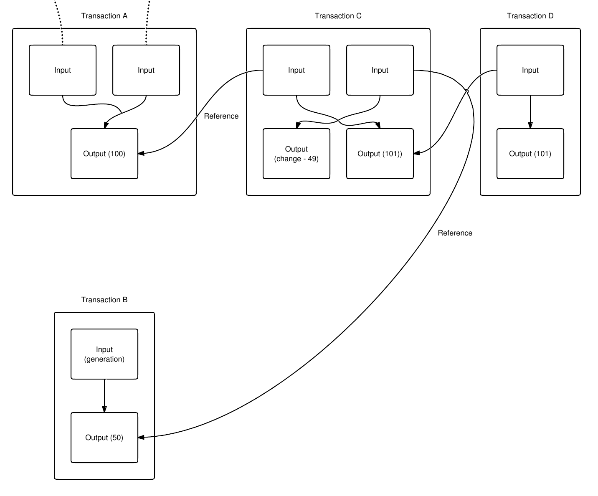

# Transaction
## 交易信息
- https://btc.com/b0f463c861564eb0bc63001b350fd40f7df8d684a93f1c8b2db34b341a00406f
  
- 如上所展示,交易信息主要包括这几个部分:
  - 输入
  - 输出
  - 金额
  - 费用
- **确认**
```
“确认”这个概念也要解释一下，一个区块产生之后，它不是立即可信的，网络上的节点总是相信最长的区块链，当一条交易记录被打包进一个区块之后，就有了一个确认，而这个区块所在的链后面被再加入一个区块，就是第二个确认，如此下去，一个交易有了6个确认，我们就认为这个交易已经确定了，会被永远记录在区块链中。为什么是6个确认呢？因为每一个确认就是一个挖矿过程，都需要提供非常严格的计算，因此，这6个区块被同一个矿工创建的可能性微乎其微（可以说是不可能），因此矿工伪造交易也基本不可能。

由于比特币的区块平均产生时间是10分钟，所以一个交易要1小时左右才能保证成功（最快），不过也不是所有的系统都这样认为,有些网站在接受比特币支付时，认为4个确认就可以给客户发货了。如果不幸这个交易在创建的时候，没有被打包进最近的那个区块，那就要延迟10分钟，如此下去，如果后面过了好几个区块，交易都没有被打包进区块链，那就悲剧了。
```

- **广播交易**
```
不过也不用着急，比特币系统中只留给了这种优先级高的交易50k的存储空间，即使你没有给交易费，也可能在24小时内被打包进区块。不过也不一定，有些交易可能永远都进不了区块，因为矿工是从自己都内存中获取自己暂存的交易信息，一旦这些内存被释放，那么这些交易信息就会被清空。为了解决这个问题，比特币钱包需要不断对自己发起的交易进行检查，如果发现没有被打包进最新的区块，就要对网络广播，这样，这个交易就会在网络里不断被提起，矿工又可以把这笔交易写进自己的内存里暂时放着，等到下次打包区块时，选择是否把它打包进去。
```
- 创建（输入输出）-广播-挖矿-打包-确认
## 转账


## utxo模型
- 一个Input指向的是前面区块的某个Output，只有Coinbase交易（矿工奖励的铸币交易）没有输入，只有凭空输出
- 还没有被下一个交易花费的Output被称为UTXO：Unspent TX Output，即未花费交易输出
- 因此，比特币的交易模型和我们平时使用的银行账号有所不同，它并没有账户这个说法，只有UTXO。想要确定某个人拥有的比特币，并无法通过某个账户查到，必须知道此人控制的所有UTXO金额之和

# 钱包地址
## 地址种类
- P2PKH or Legacy address 
  ```
  (old address format) is the first version of a Bitcoin address that starts with the number "1" and has 26 to 36 characters. The average fee when sending from a P2PKH address is usually higher than when sending from a Segwit address, because transactions with outdated addresses are larger in size.
  ```
- P2SH 
  ```
  P2SH is the new address type is structured similarly to P2PKH, but starts with "3" instead of "1". P2SH provides more complex functionality than the previous type of address. In order to spend bitcoins sent via P2SH, the recipient must provide a script corresponding to the script hash and data, which makes the script true. However, all that an ordinary user needs to know is that using this type of address instead of P2PKH, the average transaction fee will be less.
  ```
- P2WPKH or Bech32 
  ```
  Bech32 is an advanced type of address that is used to reduce blockchain block sizes to speed up transaction response time. Addresses start with "bc1" and are longer than P2PKH and P2SH. Bech32 is the native Segwit addressing format (although P2SH can also be a **Segwit address**), so usually speaking about the use of Segwit addresses Bech32 is meant.
  ```

## xpub key
### 创建钱包后，钱包会生成对应的xpub,即扩展公钥, 只需要导出即可在区块链浏览器来查询自己钱包的所有transaction,可能会涉及到多个address
- xpub
  - https://github.com/bitcoin/bips/blob/master/bip-0044.mediawiki
  - 对应地址类型P2PKH, public address以`1`开头
  - 例如：`xpub6CGu7zvJDugE3z8sNWfHoxgJuowogz1n2oyGd9Ri4bJ99G4MPatd1XiMaF4rsiFgFLzxkqVt692N3FNt2ZunrkCvAZ1mxANgRYcxm9QKvJS`
- ypub
  - https://github.com/bitcoin/bips/blob/master/bip-0049.mediawiki
  - 对应地址类型P2SH, public address以`3`开头
  - 例如：`ypub6WyrSKG81RJqNK5iGgn4sWJrWvnZVtDxjcGyvsQwXuLQvAd7aj14diQ4hqrZ6cqZj79bML9uMkengGJ2trn8MjyyeuLkdZZWnoJMyfFkNi6`
- zpub
  - https://github.com/bitcoin/bips/blob/master/bip-0084.mediawiki
  - 对应地址类型Bech32,, public address以`bc1`开头
  - 例如：`zpub6rgaZUHE3LoguGbyZKgYMP3pNqyBFFCCAyfftr9AZp4WWPELdhgqnT3NRX1JVTdfyMecggUzqkMpKqnQtDgM9ysB9bfYixHbnpENp6aB1uX`

## change address
- 出于个人隐私和财产安全考虑,有的比特币钱包在接收完一笔转账以后，默认会生成新的receive address(可以选择是否默认每次都更新地址)
- 进行send交易时，需要指定找零地址，如果没有指定，那么交易涉及到的utxo模型中，大于send amount的部分金额则会作为fee,成为矿工奖励
- 可以参考:https://community.trustwallet.com/t/why-did-my-receiving-address-changed/489


## 多签交易
https://electrum.readthedocs.io/en/latest/multisig.html?highlight=Multisig

# 常用钱包
## 钱包种类
- Mobile Wallets
- Web Wallets
- Desktop Wallets
- Hardware Wallets

https://blog.hubspot.com/marketing/bitcoin-address#:~:text=A%20Bitcoin%20address%20indicates%20the,to%20your%20friend's%20Bitcoin%20address.

# blockbook api
## 支持的blockchain及地址协议
- https://github.com/trezor/blockbook/blob/master/docs/api.md

## api解析
- /api/v2/address/0xb3e04bc11D465439f538d9AB36Cb2873291ce07b?details=txslight&pageSize=1
```
{
    "page": 1,
    "totalPages": 6,
    "itemsOnPage": 1,
    "address": "0xB3E04bC11D465439f538d9AB36Cb2873291ce07B",
    "balance": "0",
    "unconfirmedBalance": "0",
    "unconfirmedTxs": 0,
    "txs": 6,
    "nonTokenTxs": 5,
    "transactions": [
        {
            "txid": "0x9633fbe9532bf9da3c813b3747cc19324b9e46eb57a9a10d31ec8d8ca53a28d6",
            "vin": [
                {
                    "n": 0,
                    "addresses": [
                        "0xB3E04bC11D465439f538d9AB36Cb2873291ce07B"
                    ],
                    "isAddress": true
                }
            ],
            "vout": [
                {
                    "value": "157123630000000000",
                    "n": 0,
                    "addresses": [
                        "0x897E883B637b0A828f2227eBBA056FCfec9Bd6eA"
                    ],
                    "isAddress": true
                }
            ],
            "blockHash": "0xfd80b088edb9ec886b7523986db23b44f0057ce2b247762844025e94ba0750ac",
            "blockHeight": 12093471,
            "confirmations": 7522,
            "blockTime": 1616480785,
            "value": "157123630000000000",
            "fees": "3339000000000000",
            "ethereumSpecific": {
                "status": 1,
                "nonce": 3,
                "gasLimit": 21000,
                "gasUsed": 21000,
                "gasPrice": "159000000000",
                "data": "0x"
            }
        }
    ],
    "nonce": "4",
    "tokens": [
        {
            "type": "ERC20",
            "name": "USD Coin",
            "contract": "0xA0b86991c6218b36c1d19D4a2e9Eb0cE3606eB48",
            "transfers": 2,
            "symbol": "USDC",
            "decimals": 6,
            "balance": "0"
        }
    ]
}
```
- /api/v2/address/1ADi5pMSK1dgM4wdtAAMQKa8PEfVMXXf1C?details=txslight&pageSize=1
```
{
    "page": 1,
    "totalPages": 2,
    "itemsOnPage": 1,
    "address": "1ADi5pMSK1dgM4wdtAAMQKa8PEfVMXXf1C",
    "balance": "0",
    "totalReceived": "1016",
    "totalSent": "1016",
    "unconfirmedBalance": "0",
    "unconfirmedTxs": 0,
    "txs": 2,
    "transactions": [
        {
            "txid": "b0f463c861564eb0bc63001b350fd40f7df8d684a93f1c8b2db34b341a00406f",
            "vin": [
                {
                    "n": 0,
                    "addresses": [
                        "1ADi5pMSK1dgM4wdtAAMQKa8PEfVMXXf1C"
                    ],
                    "isAddress": true,
                    "value": "1016"
                }
            ],
            "vout": [
                {
                    "value": "825",
                    "n": 0,
                    "addresses": [
                        "1EdmbZnbHRny9PASgW2tV9sVKcEf1FG282"
                    ],
                    "isAddress": true
                }
            ],
            "blockHash": "0000000000000000000a66fc581f96c5832b8b81031501f2d22e188be50ee252",
            "blockHeight": 675715,
            "confirmations": 369,
            "blockTime": 1616383153,
            "value": "825",
            "valueIn": "1016",
            "fees": "191"
        }
    ]
}
```
- /api/v2/xpub/xpub661MyMwKB68aQvxD4NtkMhrnz1KtPuCHynN7jxXeNx4mYPHbAQhYWNaoV4kqLUdCHZqYkTVpMER6QG9pXDLMPksiMDM9JqjKecpzWrYeiJv?details=txslight&pageSize=1&token=used
```
{
    "page": 1,
    "totalPages": 6,
    "itemsOnPage": 1,
    "address": "xpub661MyMwKB68aQvxD4NtkMhrnz1KtPuCHynN7jxXeNx4mYPHbAQhYWNaoV4kqLUdCHZqYkTVpMER6QG9pXDLMPksiMDM9JqjKecpzWrYeiJv",
    "balance": "0",
    "totalReceived": "586701",
    "totalSent": "586701",
    "unconfirmedBalance": "0",
    "unconfirmedTxs": 0,
    "txs": 6,
    "transactions": [
        {
            "txid": "be5896ec764d64144cf66e6c8d4e46899d23eefb470a9a8494b17e15378dedf0",
            "vin": [
                {
                    "n": 0,
                    "addresses": [
                        "14ury9LoJQXo2dPRjBU8dgXbre2YdpsiYL"
                    ],
                    "isAddress": true,
                    "value": "50000"
                }
            ],
            "vout": [
                {
                    "value": "42360",
                    "n": 0,
                    "addresses": [
                        "3Bw1FaPWqvvuCEjjxhkBSz3F9Tw67ooxQb"
                    ],
                    "isAddress": true
                }
            ],
            "blockHash": "000000000000000000076cfe57288176169b69971e8db4c0db44ae3b602c3a39",
            "blockHeight": 669196,
            "confirmations": 6889,
            "blockTime": 1612516423,
            "value": "42360",
            "valueIn": "50000",
            "fees": "7640"
        }
    ],
    "usedTokens": 3
}
```


