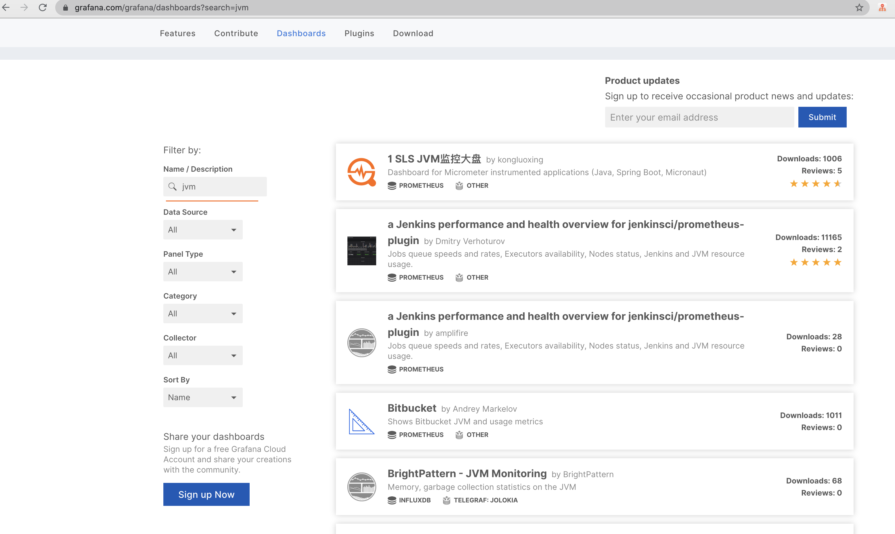

# monitoring
## why need monitoring
- without monitoring
    - restart/shutdown not found
    - to locate the issue is difficult
    - improvement performance is difficult(need to locate the key point,history data,and so on)
- with monitoring
    - solve most of the above problems, keep it more and more stable
## what do we need to monitoring
### physical resources
- cpu usage
- memory
- jvm
- threads
- thread states
- log event
### middleware
- postgresql
    - slow query
    - resource
### external api(like exchange api,blockbook api)
- endpoint status
- response time
- error

### key web transactions(like register,add one wallet)
- response time
- throughput
- error

### back-ground job(currency rate sync task)
- execution time
- error

## Prometheus&Grafana
- introduction 
    - Prometheus : https://prometheus.io/docs/introduction/overview/
    - Grafana : https://grafana.com/docs/grafana/next/getting-started/
    - opensource
    - Architecture
        
- internal java metrics
    - http(as client,as server)
    - jvm
    - jdbc
    - logback
    - process
    - system
    - up
    
- set up monitoring config on Grafana
    - import dashboard
        - login grafana,select import
        
        - get dashboard id from https://grafana.com/grafana/dashboards
        
        - copy the dashboard id
        
        - import the dashboard to grafana
        
        - show the imported dashboard
        
    - create self-define dashboard
        
        
- set up alert config on Grafana
    - create notify channel
    
    
    - create alerts
    
    
- When does it not fit?
```
Prometheus values reliability. You can always view what statistics are available about your system, even under failure conditions. If you need 100% accuracy, such as for per-request billing, Prometheus is not a good choice as the collected data will likely not be detailed and complete enough. In such a case you would be best off using some other system to collect and analyze the data for billing, and Prometheus for the rest of your monitoring.
```
## Newrelic
- introduction
- set up monitoring config
    - external api status
    - service map(external api)

## recommended flow
- keep often look at the monitoring dashboard
- set up alert conditions
- when receive the alert, create one jira,then locate the reason and fix the issue
- wiki record,to record the issue and solution
