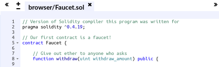

## 对比比特币和以太坊

## 智能合约

以太坊的智能合约并非现实中常见的合同，而是存在区块链上，可以被触发执行的一段程序代码，这些代码实现了某种预定的规则，是存在于以太坊执行环境中的“自治代理”。

以太坊的智能合约设计很简明。

- 任何人都可以在以太坊区块链上开发智能合约，这些智能合约的代码是存在于以太坊的账户中的，这类存有代码的账户叫合约账户。对应地，由密钥控制的账户可称为外部账户。
- 以太坊的智能合约程序，是在以太坊虚拟机（Ethereum Virtual Machine,EVM）上运行的。
- 合约账户不能自己启动运行自己的智能合约。要运行一个智能合约，需要由外部账户对合约账户发起交易，从而启动其中的代码的执行。

以太坊提供了图灵完备的编程语言（Solidity）和相应的运行环境（EVM）。所谓图灵完备，指的是这个脚本编程语言可以运行所有可能的计算，而比特币的模型和脚本只能运行部分计算。

## 钱包

### 类型

- 移动钱包
- 桌面钱包和
- 基于网络的钱包

### 功能

- 进行密钥管理
- 必要情况下助记词可以用来帮助重新访问账户资产
- 一个轻量级客户端，可以用来进行链上资产交易
- 可以和合约账户进行交互
- 所有交易都可以在https://etherscan.io/ 查询

### 不同钱包对比

#### MetaMask

MetaMask 是一款浏览器扩展钱包，可在你的浏览器（Chrome，Firefox，Opera 或 Brave Browser）中运行。它易于使用且便于测试，因为它可以连接到各种以太坊节点和测试区块链（请参阅“testnets”）。

#### Jaxx

Jaxx 是一款多平台和多币种钱包，可在各种操作系统上运行，包括 Android，iOS，Windows，Mac 和 Linux。对于新用户来说，它通常是一个不错的选择，因为它的设计简单易用。

#### MyEtherWallet (MEW)

MyEtherWallet 是一款基于网络的钱包，可在任何浏览器中运行。它具有多个复杂的功能，我们将在许多示例中探讨这些功能。

#### Emerald Wallet

Emerald 钱包设计用于以太坊经典区块链，但与其他以太坊区块链兼容。它是一款开源桌面应用程序，适用于 Windows，Mac 和 Linux。Emerald 钱包可以运行一个完整的节点或连接到一个公共的远程节点，工作在“轻量”模式下。它还有一个配套工具来在命令行中执行所有操作。

## 进行第一笔交易

- 使用 chrome 插件:MetaMask,在 Rposten Test Network 中获取 ether
- 交易完成会生成一笔交易记录，可以用来在https://etherscan.io/查询交易信息
- 通过 MetaMask 向测试网络 Faucet 账户 sell 1 个 ether

## 编写第一个合约

### demo contract

- 使用 solidity+remix 编写第一个合约
- 在区块链上注册合约涉及创建一个特殊交易，其目标是地址 0x0000000000000000000000000000000000000000，也称为 zero address。零地址是一个特殊的地址，告诉以太坊区块链你想注册一个合约
- 合约创建提交后会在https://etherscan.io/ 查询到对应的创建交易记录,同时可以看到对应的合约地址
- 通过 MetaMask，在测试网可以直接和合约地址进行交易，向合约地址 sell 1 个 ether，会有相应的 gas fee(对应其相应世界计算机的意义,简单理解就是使用计算资源需要付费)
- 在 remix 通过 MetaMask 调用合约，触发合约执行逻辑

## EOA&Contract account

- 在 MetaMask 钱包中创建的账户类型称为 Externally Owned Account（EOA） 。外部所有账户是那些拥有私人密钥的账户，它控制对资金或合约的访问。合约账户由以太坊区块链记录，由 EVM 执行的软件程序的逻辑所拥有（和控制）。
- 将来，所有以太坊钱包可能会作为以太坊合约运行，模糊了外部所有账户和合约账户之间的区别。但是永远保持的重要区别在于：人们通过 EOA 做出决定，而软件通过合约做出决定。
- 合约有一个地址，就像 EOAs（钱包）一样。合约可以发送和接收 ether，就像钱包一样。当交易目的地是合约地址时，它会导致该合约在 EVM 中运行，并将交易作为其输入。
