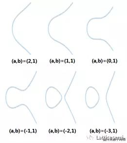
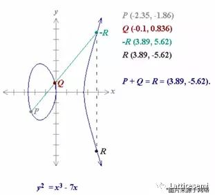
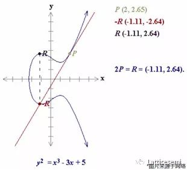
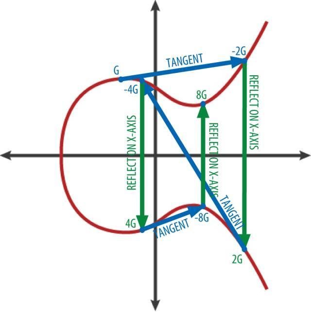

- [密钥和地址](#密钥和地址)
- [椭圆曲线算法(Elliptic curve cryptography)](#椭圆曲线算法elliptic-curve-cryptography)
# 密钥和地址
- 从随机数生成私钥
- 以太坊公钥是一个椭圆曲线上的点point，意思是它是一组满足椭圆曲线方程的X和Y坐标,公钥使用椭圆曲线乘法和私钥计算，这是不可逆的：K = k * G，其中k是私钥，G是一个称为generator point的常数点，K是结果公钥
- 以太坊地址是 唯一标识符 unique identifiers，它们是使用单向哈希函数（Keccak-256）从公钥或合约派生的
- 以太坊地址格式
  - 以太坊地址是十六进制数字，从公钥的Keccak-256哈希的最后20个字节导出的标识符
  - 使用大写校验和的十六进制编码 (EIP-55)
- 加密哈希函数特性
  - 确定性
  ```任何输入消息总是产生相同的哈希摘要 ```
  - 可验证性
  ```计算消息的哈希是有效的（线性性能）```
  - 不相关
  ```对消息的小改动（例如，一位改变）会大幅改变哈希输出，以致它不能与原始消息的哈希相关联```
  - 不可逆性
  ```从哈希计算消息是不可行的，相当于通过可能的消息进行蛮力搜索```
  - 碰撞保护
  ```计算两个不同的消息产生相同的哈希输出应该是不可行的```
# 椭圆曲线算法(Elliptic curve cryptography)  
```
一条椭圆曲线可以使用二元三次方程来表示，比如: y^2 = x^3 + ax + b
```

下图展示了一些合法的椭圆曲线:


```
定义椭圆曲线上两点相加为：给定曲线两点P，Q，P+Q等于P和Q两点的连线与曲线交点沿X轴的对称点，如果P=Q，则P+P等于P在曲线上的切线与曲线交点沿X轴的对称点。
```

```
下图演示了如何计算P+Q=R(P≠Q)，将P和Q相连得到和曲线的另一个交点-R，再将-R沿X轴做对称得到最终结果R。
```



```
如果P和Q相等，下图演示了如何计算P+Q=2P=R(P=Q)，使用P点的切线得到红点-R，沿着X轴做对称得到R点。
```



```
如果我们从某一点出发（所谓的单位元，比如正整数域的1，代表一个空间里的最基本单元），不停做自增操作（所谓群操作，比如++），枚举出整个空间的集合元素可以用下图表示：
```



```
从G出发，不停做切线，找对称点，依次得到-2G，2G，-4G，4G，-8G，8G... 我们可以想象，如果直接给你一个点 Q ，而且Q = NG，你是无法直接回答N的数值是多少。N就是我们的私钥，Q就是我们的公钥。
```
* 参考: [知乎-椭圆曲线算法](https://www.zhihu.com/question/22399196)


